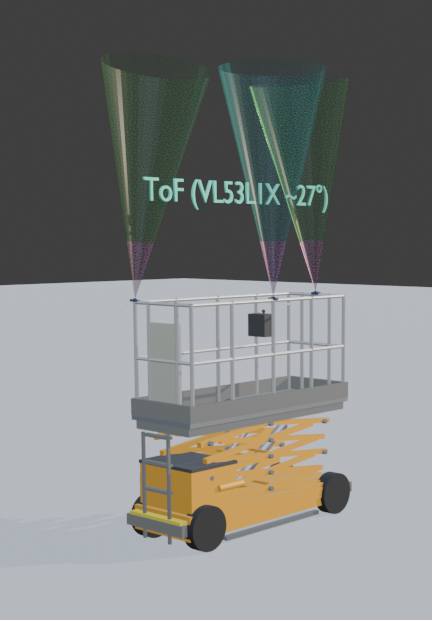
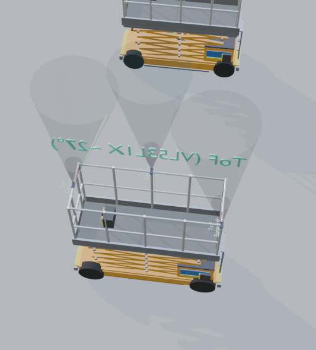
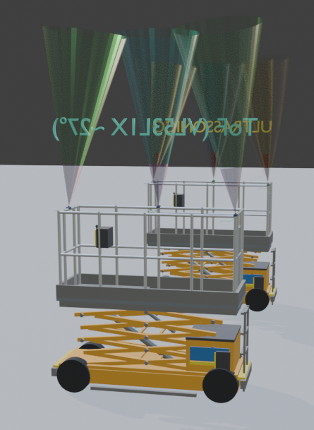

# ConectorBlender — Anti-esmagamento em plataforma elevatória (SJIII 3226)

Projeto de visualização 3D + lógica embarcada para um sistema de **detecção de obstáculos acima do cesto** em plataforma elevatória tipo tesoura, inspirado nas dimensões da **Skyjack SJIII 3226**.

O foco é um protótipo didático (TCC / prova de conceito): sensores no **topo do guarda-corpo**, apontando para **cima**, comunicando com um **ESP32** que sinaliza faixas de risco e pode **bloquear a subida**.

---

## Download do modelo 3D

Arquivo Blender do projeto (plataforma + sensores ultrassônicos + clone ToF):

📦 **[SJIII_3226_anti_esmagamento.blend](./SJIII_3226_anti_esmagamento.blend)**

Requisitos: Blender 4.x / 5.x recomendado.

---

## Visão geral

| Item | Descrição |
|------|-----------|
| Máquina de referência | Skyjack SJIII 3226 (dimensões oficiais) |
| Problema | Risco de esmagamento contra teto/viga na elevação |
| Sensores (comparativo) | Ultrassônico (lóbulo) × ToF VL53L1X (~27°) |
| Controle | ESP32 — faixas 6,0 / 3,5 / 1,5 m |
| Atuação | LED amarelo, LED vermelho + buzzer, bloqueio de subida |

### Por que os sensores ficam no topo?

Com a montagem no **alto do cesto** (e não no piso), o feixe olha para o espaço **acima** da plataforma. O operador e as ferramentas dentro do cesto ficam, em regra, **fora** do volume de leitura — o que simplifica a lógica embarcada (não é necessário “ignorar 2 m abaixo” como zona de ocupação).

---

## Galeria

### Vista geral — sistema ToF



### Detalhe do cesto e cones de leitura



### Comparativo na mesma cena (Ultrassônico × ToF)



---

## Modelo 3D (Blender)

### Dimensões da SJIII 3226 (recolhida, rails up)

| Dimensão | Valor |
|----------|------:|
| Comprimento | 2,32 m |
| Largura | 0,81 m |
| Altura (guarda-corpos erguidos) | 2,15 m |
| Plataforma interna | 2,13 × 0,71 m |
| Altura do piso do cesto | 1,14 m |
| Distância entre eixos | 1,75 m |

### Collections principais

| Collection / objeto | Conteúdo |
|---------------------|----------|
| `SJIII_3226` | Plataforma original + sensores **ultrassônicos** |
| `Sensores_Ultrassonicos` | Módulos US, volumes e zonas críticas |
| `SJIII_3226_ToF` | **Clone** da plataforma para comparativo |
| `Sensores_ToF` | Módulos ToF (VL53L1X) e cones ópticos |
| `SJIII_3226_ROOT` / `SJIII_3226_ToF_ROOT` | Empties-raiz (mover o conjunto inteiro) |

### Disposição dos sensores

Três sensores no topo do guarda-corpo, cobrindo o volume do cesto de forma escalonada:

1. **Ponta A** (fundo / uma lateral)  
2. **Meio** (lado de cá) — apontando **reto para cima**  
3. **Ponta B** (outra ponta, meia profundidade)

As pontas ficam inclinadas **7° para dentro** do cesto, para haver interseção dos volumes.

### Representação dos volumes

**Ultrassônico (mais fiel à prática):**
- Envelope limítrofe ~**30°** (muito transparente)
- Lóbulo confiável ~**15°** (detecção prática)
- Zona crítica **0,5 m** (vermelho)
- Alcance visual de referência: **2 m**

**ToF VL53L1X (comparativo):**
- Cone óptico mais **nítido**, FoV ~**27°**
- Zona crítica distinta (magenta)
- Mesmas poses relativas do sistema US, em plataforma clonada ao lado

Para rotacionar um conjunto sensor+volume, use os Empties:

- US: `Grupo_Sensor_Esquerdo` / `Central` / `Direito`
- ToF: `Grupo_Sensor_ToF_Esquerdo` / `Central` / `Direito`

---

## Lógica embarcada (ESP32)

Código do protótipo:

📁 [`esp32_anti_esmagamento/`](./esp32_anti_esmagamento/)

- `esp32_anti_esmagamento.ino` — máquina de estados  
- `config.h` — pinos e limiares  

### Faixas de distância

Sensores no **topo**, apontando para **cima**. Usa-se a **menor distância válida** entre os 3 canais:

| Distância `d` | Estado | Ação |
|---------------|--------|------|
| `d > 6,0 m` | LIVRE | Sem alerta |
| `3,5 < d ≤ 6,0 m` | AMARELO | LED amarelo |
| `1,5 < d ≤ 3,5 m` | VERMELHO | LED vermelho + buzzer |
| `d ≤ 1,5 m` | BLOQUEIO | **Bloqueia subida** |

Histerese de liberação do bloqueio: **1,7 m** (evita oscilação).

### Fluxo

```text
Ler 3 sensores
    → d = menor distância válida
    → classificar faixa (6,0 / 3,5 / 1,5)
    → LEDs + buzzer + relé de subida
```

### Parede lateral × teto (evolução)

Com a **altura/elevação da tesoura**, dá para distinguir muitos falsos positivos de fachada:

- teto/viga: distância **diminui** conforme a plataforma sobe  
- parede ao lado: distância tende a ficar **quase constante**

O sketch já deixa um esboço dessa ideia; a lógica principal do protótipo permanece nas faixas acima.

### Hardware de exemplo

- ESP32  
- 3× HC-SR04 **ou** 3× VL53L1X (ToF)  
- LED amarelo, LED vermelho, buzzer  
- Relé para interromper/bloquear comando de **subida** (preferir falha-segura)

> **Aviso:** este é um protótipo didático. Sistema de segurança real em MEWP exige redundância, validação normativa e projeto fail-safe adequado — não substitua proteções certificadas do fabricante.

---

## Estrutura do repositório

```text
ConectorBlender/
├── README.md
├── SJIII_3226_anti_esmagamento.blend   ← modelo 3D para download
├── addon.py                            ← addon Blender MCP (opcional)
├── images/
│   ├── tof_vista_geral.png
│   ├── tof_detalhe_cesto.png
│   └── comparativo_us_tof.png
└── esp32_anti_esmagamento/
    ├── esp32_anti_esmagamento.ino
    └── config.h
```

---

## Como abrir o Blender

1. Baixe / abra `SJIII_3226_anti_esmagamento.blend`
2. No Outliner, localize `SJIII_3226` (US) e `SJIII_3226_ToF` (comparativo)
3. Viewport em *Material Preview* para ver os cones transparentes

### Blender MCP (opcional)

Se quiser controlar o Blender via Cursor/Claude:

1. Instale `addon.py` em **Editar → Preferências → Complementos → Instalar do Disco**
2. Ative **Blender MCP** e clique em **Connect** na aba lateral
3. Configure o servidor MCP `blender` no Cursor (ver `.cursor/mcp.json`)

---

## Como gravar o ESP32

1. Abra `esp32_anti_esmagamento/` no Arduino IDE  
2. Selecione a placa **ESP32**  
3. Ajuste pinos e limiares em `config.h`  
4. Compile, grave e monitore a Serial em **115200 baud**

---

## Roadmap sugerido

- [ ] Trocar HC-SR04 por VL53L1X no firmware (I2C + XSHUT)  
- [ ] Entrada real de elevação da tesoura (encoder / sinal do comando)  
- [ ] Classificador parede lateral × overhead  
- [ ] Histerese e debounce por sensor  
- [ ] Log/telemetria para ensaios  

---

## Referências rápidas

- Dimensões Skyjack SJIII 3226 (especificação do fabricante)  
- HC-SR04: ângulo útil típico ~15° (effectual); envelope ~30°  
- ST VL53L1X: FoV diagonal típico ~27° (ROI programável 15–27°)  

---

## Licença / uso

Projeto acadêmico / demonstração. O modelo 3D e o firmware são fornecidos para estudo e desenvolvimento. Não utilizar como único meio de proteção em operação real sem validação de segurança.
