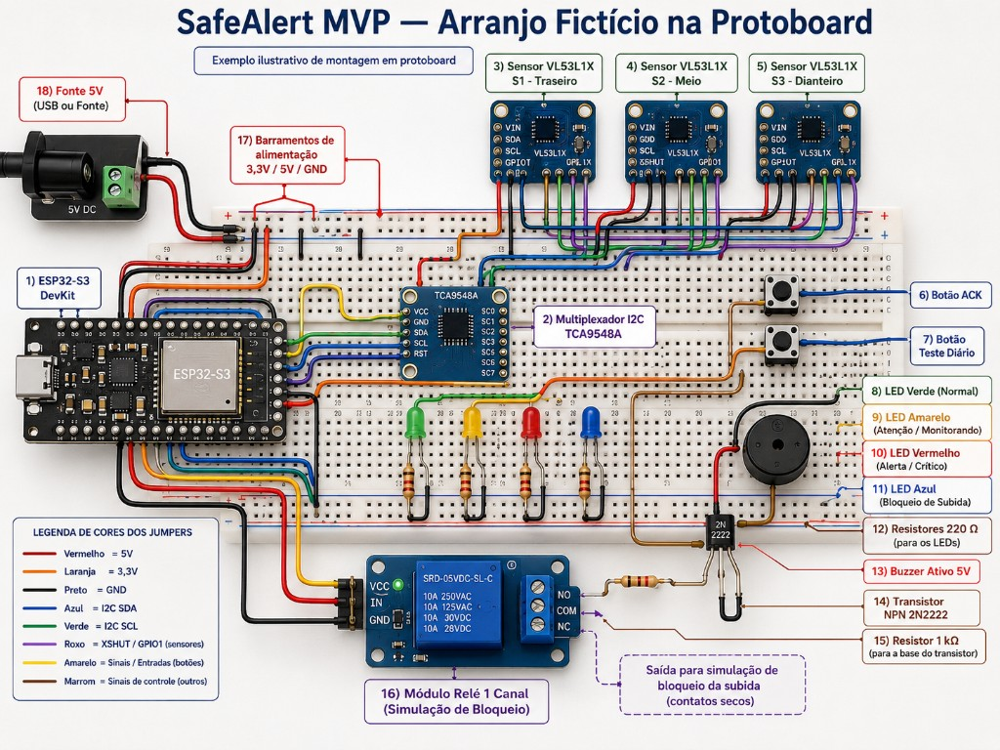
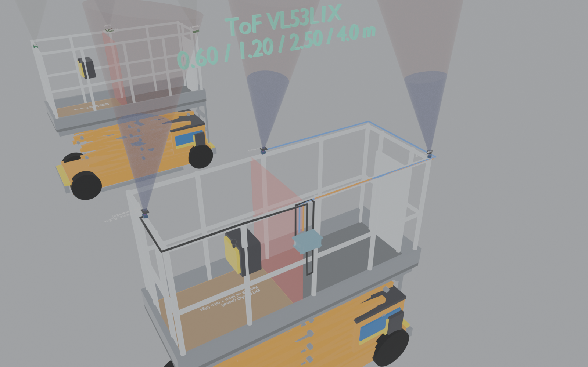
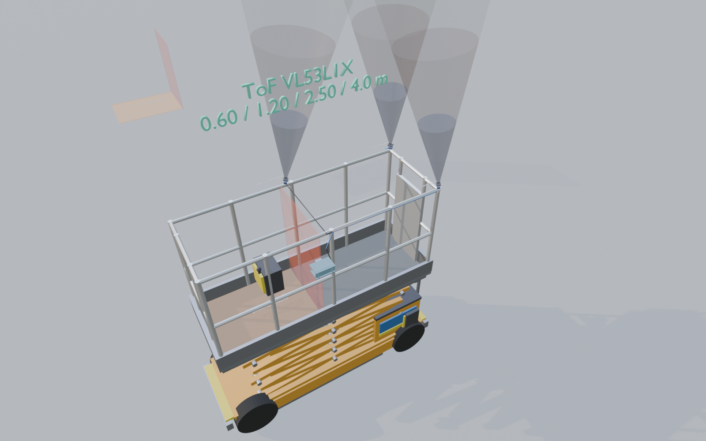

# Sistema de segurança contra esmagamento — Plataforma Tesoura (protótipo)

Projeto de visualização 3D + lógica embarcada para um sistema de **detecção de obstáculos acima do cesto** em plataforma elevatória tipo tesoura, inspirado nas dimensões da **Skyjack SJIII 3226**.

O foco é um projeto de **prototipagem**: sensores no **topo do guarda-corpo**, apontando para **cima**, comunicando com um **ESP32** que sinaliza faixas de risco e pode **bloquear a subida**.

> **Premissa do projeto:** o desafio principal é **geométrico** (onde apontar, o que o FoV enxerga, como cobrir o volume do cesto sem confundir parede/operador). A montagem eletrônica é viável e relativamente direta — ver o arranjo SafeAlert MVP abaixo.

---

## Download do modelo 3D

Arquivo Blender do projeto (plataforma + sensores ultrassônicos + clone ToF):

📦 **[SJIII_3226_anti_esmagamento.blend](./SJIII_3226_anti_esmagamento.blend)**

Requisitos: Blender 4.x / 5.x recomendado.

---

## Visão geral

| Item | Descrição |
|------|-----------|
| Máquina de referência | Skyjack SJIII 3226 (dimensões oficiais) |
| Problema | Risco de esmagamento contra teto/viga na elevação |
| Escopo de cobertura (MVP) | **Só o deck principal (fixo)** — extensão roll-out fora do FoV |
| Desafio central | Geometria do FoV e cobertura do volume do cesto principal |
| Sensores (comparativo 3D) | Ultrassônico (lóbulo) × ToF VL53L1X (~27°) |
| Controle (MVP) | ESP32-S3 + 3× VL53L1X + TCA9548A |
| Atuação | LEDs, buzzer e relé (bloqueio só em colisão iminente ~0,60 m) |
| Operador de referência | Altura média **1,80 m** — máquina não trava na folga de trabalho |
| **Faixas oficiais** | **`config.h`**: livre >2,50 · amarelo ≤2,50 · vermelho ≤1,20 · bloqueio ≤0,60 m |

> **Fonte da verdade das distâncias:** `esp32_anti_esmagamento/config.h`  
> (`DIST_AMARELO_M`, `DIST_VERMELHO_M`, `DIST_BLOQUEIO_M`, `H_OPERADOR_M`).  
> O README e o Blender ToF devem espelhar esses valores — **não** use mais 6,0 / 3,5 / 1,5 m (faixas antigas, abandonadas).

### Por que os sensores ficam no topo?

Com a montagem no **alto do cesto** (e não no piso), o feixe olha para o espaço **acima** da plataforma. O operador e as ferramentas dentro do cesto ficam, em regra, **fora** do volume de leitura — isso reduz (não elimina) o problema de falso positivo por ocupação do cesto.

### Deck extensível — fora do escopo do MVP

A SJIII 3226 tem **roll-out** em **+X** (`Extension_Deck`: X ≈ 0,105…1,015 m).  
O MVP cobre **só o retângulo do deck FIXO** (X ≈ −1,015…0,05 m).

| Decisão | Motivo |
|---------|--------|
| Sensores nos **3 cantos do retângulo fixo** | Cobertura do volume fixo; montagem em postes/cantos |
| Nenhum sensor em `X ≥ 0,105` | Extender o deck **não move** hardware |
| Cabo com **laço de folga** | Folga mecânica no harness |
| Envelope em `config.h` até `EXTENSAO_X_INICIO_M` | Hit acima da extensão → `FORA_ESCOPO` |

**Disposição canônica** (`config.h` = fonte da verdade):

```text
        +Y
         ^
  TL ●────────────────┐
     │   DECK FIXO    │     ║ limiar X=0,105
  TR ●────────────────● FR  ║→ EXTENSÃO (móvel, sem sensor)
     X=-1,015      X=0,05    X≥0,105
```

| ID | Canto | Pose (m) |
|----|-------|----------|
| `SENSOR_TRASEIRA_L` | Traseira +Y | `(-1,015, +0,355, 2,16)` |
| `SENSOR_TRASEIRA_R` | Traseira −Y | `(-1,015, −0,355, 2,16)` |
| `SENSOR_FRENTE_R` | Dianteiro do **fixo** no rail −Y | `(+0,050, −0,355, 2,16)` |

> Com a extensão **recolhida**, `X≈0,05` parece perto do meio do comprimento total da máquina (−1…+1). Estruturalmente é o **fim do fixo**; a peça móvel começa em `X≥0,105` (placa âmbar + limiar no Blender).

Rebuild: `scripts/rebuild_sensor_corners.py`

---

## Desafios previstos e soluções

O circuito (ESP32 + ToF + relé) é a parte mais “padrão”. O que realmente define se o sistema funciona no campo é a **geometria**.

### Modelo forte adotado (não é trilateração clássica)

Trilateração clássica assume **um mesmo ponto** \(P\) visto por 3 sensores.  
Com ToF/US no cesto isso quase nunca ocorre:

- teto plano → cada sensor vê um **ponto diferente** do mesmo plano  
- parede lateral → em geral **só um** FoV “raspa” a fachada  

Por isso o firmware usa:

```text
1) Hit point:     h_i = s_i + r_i * u_i
2) Envelope:      h_i ∈ V_colisao (prisma acima do cesto)?
3) Plano:         teto (Z≈const) vs parede (X ou Y≈const)
4) Elevação:      Δr ≈ −Δh → teto | Δr ≈ 0 → parede
5) Severidade:    faixas 2,5 / 1,2 / 0,6 m  (só se estiver no escopo; bloqueio só iminente)
```

| Classe | Significado | Ação típica |
|--------|-------------|-------------|
| `FORA_ESCOPO` | impacto fora do volume da máquina | monitorar (no máx. amarelo) |
| `PAREDE` | plano vertical / distância estável na subida | **não** bloquear subida |
| `TETO` | plano horizontal / fecha com a elevação | faixas + bloqueio se consenso |
| `PONTUAL_ESCOPO` | 1 hit dentro do envelope | alerta; bloqueio só se muito perto |
| `INDEFINIDO` | 2+ hits no envelope sem plano claro | fail-safe (consenso) |

### Modelo de folga do operador (arquitetura de distâncias)

A máquina **não pode travar na altura normal de trabalho**. O operador precisa conseguir alcançar o objeto acima (teto, viga, ponto de serviço).

**Hipóteses:**
- Altura média do operador: \(H_{op} = 1{,}80\,\mathrm{m}\)
- Sensor no topo do guarda-corpo: \(H_s \approx 1{,}01\,\mathrm{m}\) acima do piso do cesto
- Distância medida: \(d\) = sensor → obstáculo acima
- Folga aproximada sobre a cabeça:  
  \(g \approx d - (H_{op} - H_s) = d - 0{,}79\,\mathrm{m}\)

**Interpretação:**
- Para trabalhar com folga razoável sobre a cabeça (\(g \gtrsim 0{,}40\,\mathrm{m}\)) → \(d \gtrsim 1{,}20\,\mathrm{m}\)
- Distância piso do cesto → objeto ≈ \(H_s + d\); em \(d = 1{,}20\,\mathrm{m}\) isso dá ~\(2{,}2\,\mathrm{m}\) — compatível com pessoa de 1,8 m + braços
- **Bloqueio só na iminência:** \(d \le 0{,}60\,\mathrm{m}\) (sensor → objeto)

Assim, em área de trabalho alta (ex. até ~12 m de altura de serviço), a plataforma pode subir e o operador operar **sem** travamento precoce; o corte de subida só ocorre quando o obstáculo está **extremamente perto** do topo instrumentado.

| Faixa \(d\) | Estado | Comportamento |
|-------------|--------|----------------|
| \(d > 2{,}50\,\mathrm{m}\) | LIVRE | Folga ampla — trabalho ok |
| \(1{,}20 < d \le 2{,}50\,\mathrm{m}\) | AMARELO | Atenção — ainda sobe |
| \(0{,}60 < d \le 1{,}20\,\mathrm{m}\) | VERMELHO | Aperto + buzzer — **ainda sobe** |
| \(d \le 0{,}60\,\mathrm{m}\) | BLOQUEIO | Colisão iminente — **trava subida** |

Histerese de liberação do bloqueio: **0,75 m**.  
O filtro geométrico (envelope / teto × parede / elevação) continua **antes** dessas faixas.

### 1) Parede / fachada ao lado × obstáculo acima

**Problema**  
Sensor 1D só devolve distância. Perto de um prédio, o FoV pode “raspar” a fachada.

**Solução no projeto**
- pontos de impacto \(h_i\) fora de \(V_{\text{colisão}}\) → `FORA_ESCOPO`  
- plano vertical ou \(\Delta r \approx 0\) com subida → `PAREDE`  
- montagem com FoV para cima nos **cantos** do rail fixo (~9° ao centro do deck principal)

### 2) Operador e ferramentas dentro do cesto

**Problema**  
Braço/ferramenta no FoV pode parecer obstáculo.

**Solução**
- sensores no **topo** do guarda-corpo (operador abaixo do plano de emissão)  
- ToF com FoV ~27° (menos “varredura” que US largo)  
- faixas aplicadas ao que está **acima do sensor**, não ao piso do cesto

### 3) Cobertura do volume do cesto

**Disposição:** 3 cantos do **retângulo fixo** (FoV ~27° para cima; ToF eixo = +Z):

| Sensor | Canto do fixo | Pose `(X, Y, Z)` m |
|--------|---------------|-------------------|
| `SENSOR_TRASEIRA_L` | Traseira +Y | `(-1,015, +0,355, 2,16)` |
| `SENSOR_TRASEIRA_R` | Traseira −Y | `(-1,015, −0,355, 2,16)` |
| `SENSOR_FRENTE_R` | Dianteiro fixo −Y | `(+0,050, −0,355, 2,16)` |

Apontamento: ~8° ao centro do deck fixo. Script: `scripts/rebuild_sensor_corners.py`.

### 4) Ultrassônico × ToF

| | Ultrassônico | ToF (VL53L1X) |
|--|--------------|---------------|
| Forma do volume | Lóbulo ~15° útil + envelope ~30° | Cone óptico ~27° |
| Papel | Referência acústica no Blender | Caminho preferido do MVP |

### 5) Circuito (secundário)

ESP32-S3 + TCA9548A + 3× VL53L1X + LEDs/buzzer/relé — ver SafeAlert MVP.

---

## Galeria

### Vista geral — cones de leitura


### Cobertura do cesto em planta (overlap dos FoVs)


### Comparativo na mesma cena (Ultrassônico × ToF)


### Arranjo eletrônico SafeAlert MVP (protoboard)



### Instalação no cesto (Blender)

Caixa IP65 aberta junto ao painel de controle, com protoboard + ESP32 + TCA9548A + relé/LEDs; cabos Cat ao longo do top rail até os 3 ToF; capuzes anti-sol/poeira nos sensores. Coleção Blender: `Instalacao_MVP_ToF` (câmera `Cam_MVP_Install`).





---

## Hardware SafeAlert MVP — verificação do diagrama

O diagrama *“SafeAlert MVP — Arranjo Fictício na Protoboard”* está **conceitualmente correto** para um protótipo. Pontos principais:

### O que está certo

| Bloco | Avaliação |
|-------|-----------|
| **ESP32-S3 DevKit** | Adequado como controlador do MVP |
| **TCA9548A** | Solução correta: os 3× VL53L1X compartilham o mesmo endereço I2C |
| **S1 / S2 / S3** (3 cantos do retângulo fixo) | Traseira L/R + Frente R do fixo |
| **3V3 para mux/sensores e 5V para buzzer/relé** | Separação de trilhos coerente |
| **LEDs (verde / amarelo / vermelho / azul)** + **220 Ω** | Indicadores de estado claros para demonstração |
| **Buzzer via 2N2222 + 1 kΩ** | Evita sobrecarregar o GPIO do ESP32 |
| **Relé com contatos secos** | Boa escolha para *simular* bloqueio de subida sem amarrar ainda no circuito da máquina |
| **Botões ACK e Teste diário** | Úteis em protótipo de segurança (reconhecimento / autoteste) |
| **GND comum** entre 3V3 e 5V | Obrigatório — o diagrama prevê barramentos compartilhados |

### Atenções práticas (não invalidam o desenho)

1. **Alcance do VL53L1X** — típico até ~**4 m** em condições favoráveis (indoor / sem IR solar forte). O envelope 3D externo usa 4 m; as faixas de alerta/bloqueio (2,5 / 1,2 / 0,6 m) cabem nesse alcance **nominal**. Em sol direto o alcance útil cai — ver *Luz solar / 940 nm* abaixo.  
2. **Módulo relé SRD** — muitos são ativos em nível baixo e já trazem optoacoplador; confirme se o `IN` aceita 3,3 V do ESP32-S3.  
3. **Pull-ups I2C** — placa do TCA9548A costuma já ter; evite empilhar pull-ups demais em cada breakout VL53.  
4. **XSHUT (roxo no diagrama)** — com mux, não é obrigatório para multiplexar, mas ajuda a resetar sensores individualmente.  
5. **Fail-safe de software (MVP)** — se leituras esperadas caírem, o firmware tende a bloquear; no produto real isso precisa ser **arquitetural** (energia, canal, feedback), não só um `if` no loop.

### Luz solar / 940 nm (limite óptico outdoor)

O VL53L1X emite e mede em **~940 nm** (VCSEL + SPADs). A luz solar direta também carrega muita energia nessa faixa. Em uso **outdoor sob sol forte**, o IR ambiente satura o receptor: a SNR cai e o alcance útil pode despencar de ~**4 m** para ~**1 m ou menos**, com leituras ruidosas ou status de falha (`SignalFail` / range inválido). Isso é física do sensor, não bug do firmware.

**Filtro óptico ajuda?** Em parte, e com nuance:

| Abordagem | O que faz | Limite |
|-----------|-----------|--------|
| **Filtro passa-banda 940 nm** (já existe *dentro* do pacote ST; externo opcional) | Rejeita luz fora da banda (visível, outras lâmpadas) | O **sol também emite em 940 nm** — o filtro *passa* esse ruído. Ajuda pouco contra sol direto no FoV |
| **Capuz / rebaixo mecânico / sombra** | Reduz sol direto no receptor e no alvo iluminado | Mais eficaz na prática que “só filtro” |
| **Distance mode Short** (API ST) | Melhor imunidade a luz ambiente | Alcance típico limitado (~**1,3 m**) — útil perto do bloqueio, ruim para faixa amarela 2,5 m |
| **Timing budget / status / ambient rate** | Descartar leituras inválidas; não confiar em distância “fantasma” | Sem fail-safe, ruído vira falso livre ou falso alarme |
| **Sensor outdoor mais robusto** (ex. famílias com mais SPADs, p.ex. VL53L8CX) | Melhor margem sob sol | Custo e redesign do FoV |

Neste protótipo os sensores apontam **para cima** (teto / estrutura acima do cesto). Isso é o pior caso geométrico sob céu aberto: céu/sol no FoV. Ensaios de campo devem incluir **sol a pino**, sombra e interior.

**Regra de projeto:** leitura inválida ou ambient saturado → tratar como **ameaça / bloquear subida** (estado seguro), nunca como “livre”. Filtro externo pode ser experimento de hardware; **não** contar com ele para recuperar os 4 m sob sol.

### Chuva, poeira e sujeira na óptica

Obra e outdoor acumulam **água, lama e pó** no caminho óptico. O VL53L1X precisa de janela limpa (cover glass / abertura do módulo); qualquer filme opaco ou gota no FoV mexe na distância medida.

| Situação | Efeito típico no ToF | Efeito no circuito (ESP / mux / relé) |
|----------|----------------------|--------------------------------------|
| **Poeira / cimento / lama no sensor** | Atenua ou bloqueia o retorno IR → alcance cai, distância “fantasma”, ou status de falha; sujeira grossa pode parecer **alvo muito perto** (falso bloqueio) ou **sem eco** (falso livre se o firmware ignorar falha) | Pouco, se a eletrônica estiver selada; pó fino em conectores abertos → mau contato I2C |
| **Gotas / chuva na janela** | Refração/espalhamento; leituras instáveis; película d’água ≈ alvo próximo | Água na protoboard / DevKit → curto, corrosão, reset aleatório |
| **Condensação interna** | Embaça a face interna do cover | Mesmo risco elétrico + oxidação |

**Prevenção (mecânica — o que mais importa)**

1. **Eletrônica em caixa IP65** (já no BOM) com prensa-cabos / gland — ESP, TCA9548A e relé **não** ficam expostos. Protoboard aberta = só bancada.  
2. **Sensores em cápsula própria** (mini housing IP65/IP67) com **cover glass** compatível com 940 nm (acrílico/policarbonato IR-pass ou vidro especificado pela ST — espessura e air-gap conforme AN da ST).  
3. **Capuz + pingente / borda de gotejamento** — reduz chuva direta e poeira sedimentando na face óptica (combina com a sombra anti-sol). Apontar para cima piora acúmulo de poeira e água na janela.  
4. **Inclinação leve da face** (se a geometria permitir) para escoar água; evitar “poça” sobre o sensor.  
5. **Limpeza periódica** no checklist do teste diário (pano macio; sem abrasivo que risque o cover). Em obra, poeira no sensor é evento esperado, não exceção.

**Prevenção (elétrica / firmware)**

- Conformal coating na PCB do produto; evitar DevKit nu no campo.  
- Monitorar **signal rate / range status**: queda persistente de sinal em todos os canais com histórico de uso → suspeita de **sujeira**, não só de teto longe.  
- Autoteste diário: se eco de referência (guarda-corpo / alvo conhecido) sumir → **não liberar subida** até limpeza/ACK.  
- Cabos com alívio e entrada selada; conectores IP ou dentro da caixa.

**Escopo do MVP:** caixa IP65 para o núcleo; sensores em breakout ainda vulneráveis até haver housing + cover. Ensaio de campo deve incluir **poeira na janela** e **gotas** de propósito, para ver falso bloqueio vs falha muda.

### Limites elétricos e de norma (protótipo ≠ produto)

Este MVP **reconhece** os cuidados básicos de interface (transistor no buzzer, relé a contatos secos, trilhos 3V3/5V). Isso **não** é projeto de segurança funcional de MEWP. De forma deliberada e explícita:

| Tema | Neste protótipo | O que um produto real exigiria |
|------|-----------------|--------------------------------|
| **Isolamento galvânico** | Relé com opto no módulo SRD isola *parcialmente* a bobina do GPIO; **não** há barreira projetada entre lógica, alimentação da máquina e I/O de segurança | Isolamento / barreira conforme categoria elétrica; interface à máquina tipicamente via contatos secos **ou** I/O de segurança certificado, sem partilhar GND de potência com a lógica do sensor |
| **Categoria / desempenho** | Canal único ESP32 + sensores | Avaliação **SIL** (IEC 61508) e/ou **PL** (ISO 13849); arquitetura adequada (ex.: PLd/SIL2 conforme análise de risco) |
| **Norma de plataforma** | Fora de escopo | Requisitos de segurança de MEWP (**EN 280** / equivalentes) e integração com o sistema de controle do fabricante |
| **Redundância de canal** | Um MCU, um mux I2C, um relé | Dois canais independentes (ou canal + diagnóstico contínuo), comparação cruzada, falha → **estado seguro** (impedir subida) |
| **Diagnóstico** | Botões ACK / teste diário (conceito) | Autoteste periódico, watchdog, detecção de sensor preso/aberto, monitoração do atuador |

**Escopo:** estes tópicos entram no roadmap de um produto; o protótipo atual prioriza geometria de cobertura e demonstração de bloqueio. Relé na protoboard **não** é função de segurança certificada.

### Mapeamento sugerido de estados (LEDs do diagrama)

| Estado | LEDs / atuadores |
|--------|------------------|
| Normal / livre | Verde |
| Atenção (`d ≤ 2,5 m`) | Amarelo |
| Alerta (`d ≤ 1,2 m`) | Vermelho + buzzer (**ainda sobe**) |
| Bloqueio (`d ≤ 0,6 m`) | Azul + relé + buzzer |

---

## Componentes necessários (BOM do protótipo)

Orçamento-alvo de hardware: **até ~R$ 400**.  
O **ESP fica em caixa protegida perto do painel de controle no cesto**; os 3 ToF ficam espalhados no guarda-corpo (cabos ~1–3 m ao longo do rail — não descer a tesoura). Em campo, breakouts ToF sem housing sofrem **chuva/poeira na óptica** — ver seção correspondente.

### Núcleo eletrônico

| Qtd | Componente | Função | Faixa R$ |
|----:|------------|--------|----------|
| 1 | ESP32-S3 DevKitC (N8R2 ou N16R8, USB-C) | Controle | 70–95 |
| 3 | VL53L1X (módulo breakout) | Sensores ToF | 75–120 |
| 1 | TCA9548A (mux I2C 8 canais) | 3 sensores no mesmo endereço | 15–25 |
| 1 | Módulo relé 1 canal 5 V (com opto) | Simular bloqueio de subida (contatos secos) | 10–18 |
| 1 | Buzzer ativo 5 V | Alarme sonoro | 3–8 |
| 2 | Transistor NPN 2N2222 (ou BC547) | Driver do buzzer (+ reserva) | 1–3 |
| 1 | Kit resistores (220 Ω, 1 kΩ, 10 kΩ) | LEDs, base do transistor, pull-ups | 8–15 |
| 4–8 | LEDs 5 mm (verde, amarelo, vermelho, azul) | Estados | 3–6 |
| 2–4 | Botões táteis | ACK + teste diário | 2–5 |
| 1 | Fonte 5 V 2 A (USB/fonte parede ou buck) | Alimentação | 20–40 |

### Cabos e instalação no cesto

| Qtd | Componente | Função | Faixa R$ |
|----:|------------|--------|----------|
| 10–15 m | Cabo Cat5e/Cat6 | I2C em par trançado + 3V3/GND | 25–45 |
| 6–10 pares | Conectores JST-XH / GX12 / bornes 4 vias | Desmontar sensores sem cortar cabo | 15–30 |
| 1 kit | Espaguete / heat shrink + abraçadeiras | Proteção mecânica | 10–20 |
| — | Fita 3M / clamps de trilho | Fixar módulos no guarda-corpo | 8–15 |

### Proteção do ESP (junto ao painel)

| Qtd | Componente | Função | Faixa R$ |
|----:|------------|--------|----------|
| 1 | Caixa plástica IP65 (~100×68×50 mm) | Proteger ESP + mux + relé | 20–35 |
| 2–3 | Prensa-cabos PG7/PG9 | Entrada/saída de cabos | 5–10 |
| 1 | Protoboard mini ou placa ilhada | Montagem interna | 8–20 |
| 1 | Fusível 1 A + suporte (ou polyfuse) | Proteção de alimentação | 3–8 |

### Totais estimados

| Cenário | Total |
|---------|------:|
| Compra enxuta | ~R$ 300–350 |
| Lojas BR + frete | ~R$ 360–400 |

Se estourar o teto: use **ESP32-WROOM-32 DevKit** (~R$ 35–50) no lugar do S3.

### Opcional (só se sobrar verba)

| Item | Quando | Faixa R$ |
|------|--------|----------|
| Extensor I2C (PCA9615 / P82B715) | Cabo > ~1,5–2 m ou leituras instáveis | 20–40 |
| Buck 7–24 V → 5 V | Alimentar da bateria 12/24 V da máquina | 15–30 |
| 3× mini housing IP65 + cover IR-pass | Campo com chuva/poeira nos ToF | 30–60 |
| Capuz / viseira impressa (PETG) | Sombra + gotejamento na óptica | 0–15 (filament) |

### Arquitetura física

```text
[Caixa IP65 no painel do CESTO]
  ESP32-S3 + TCA9548A + relé + buzzer + LEDs/botões
           |
     Cat6: 3V3, GND, SDA, SCL  (+ XSHUT opcional)
           |
    ┌──────┼──────────────┐
  ToF S1          ToF S2          ToF S3
  Traseira L      Traseira R      Frente R (fixo)
```

**Notas:** I2C não gosta de cabo longo — use Cat6, clock baixo (~50 kHz) e GND comum 3V3/5V. O firmware atual ainda lê HC-SR04 por GPIO; a porta para VL53L1X+TCA9548A está no roadmap. Cabos só no rail do **deck fixo**, com **laço de folga** — estender o roll-out não puxa a instalação MVP.

---

## Modelo 3D (Blender)

### Dimensões da SJIII 3226 (recolhida, rails up)

| Dimensão | Valor |
|----------|------:|
| Comprimento | 2,32 m |
| Largura | 0,81 m |
| Altura (guarda-corpos erguidos) | 2,15 m |
| Plataforma interna | 2,13 × 0,71 m |
| Extensão roll-out (ref.) | ~0,9 m em +X — **fora do FoV no MVP** |
| Altura do piso do cesto | 1,14 m |
| Distância entre eixos | 1,75 m |

### Collections principais

| Collection / objeto | Conteúdo |
|---------------------|----------|
| `SJIII_3226` | Plataforma original + sensores **ultrassônicos** |
| `Sensores_Ultrassonicos` | Módulos US, volumes e zonas críticas |
| `SJIII_3226_ToF` | **Clone** da plataforma para comparativo |
| `Sensores_ToF` | Módulos ToF (VL53L1X) e cones ópticos |
| `SJIII_3226_ROOT` / `SJIII_3226_ToF_ROOT` | Empties-raiz (mover o conjunto inteiro) |
| `Zona_Extensao` | Marcação âmbar do roll-out (**sem** sensores) |
| `Instalacao_MVP_ToF` | Caixa IP65, cabos e capuzes (só rail fixo) |

### Representação dos volumes no 3D

**Ultrassônico:** envelope ~30° + lóbulo útil ~15° + zona crítica 0,5 m  
**ToF:** camadas alinhadas à lógica de folga do operador (FoV ~27°):

| Camada | Alcance | Cor | Significado |
|--------|---------|-----|-------------|
| `Volume_ToF_Alcance_*` | **4,0 m** | ciano suave | alcance útil típico VL53L1X |
| `Volume_ToF_Amarelo_*` | **2,5 m** | amarelo | atenção — ainda trabalha/sobe |
| `Volume_ToF_Vermelho_*` | **1,2 m** | vermelho | aperto + buzzer — ainda sobe |
| `Volume_ToF_Bloqueio_*` | **0,6 m** | azul | **bloqueio** (iminente) |

Empties (cantos do fixo, `X ≤ 0,05`):

- `corner` = `Traseira_L` | `Traseira_R` | `Frente_R_Fixo`

---

## Lógica embarcada (ESP32)

Código do protótipo com **classificador geométrico**:

📁 [`esp32_anti_esmagamento/`](./esp32_anti_esmagamento/)

| Arquivo | Função |
|---------|--------|
| `config.h` | Faixas, pinos, poses \(s_i, u_i\), envelope do cesto |
| `geometry.h` | Hit points, envelope, teto/parede, elevação, consenso |
| `esp32_anti_esmagamento.ino` | Leitura, máquina de estados, saídas |

### Pipeline

```text
Ler r0,r1,r2
  → h_i = s_i + r_i * u_i
  → contar hits em V_colisao
  → classificar FORA_ESCOPO | PAREDE | TETO | ...
  → se ameaça no escopo: faixas 2,5 / 1,2 / 0,6
  → vermelho ainda SOBE; bloqueio só d≤0,60
  → se parede/fora: no máximo AMARELO (não bloqueia)
  → LEDs + buzzer + relé
```

### Faixas de severidade (após geometria)

Valores iguais a `config.h` (única tabela vigente — **não** use 6,0 / 3,5 / 1,5 m):

| Distância `d` (ameaça no envelope) | Constante | Estado | Ação |
|-----------------------------------|-----------|--------|------|
| `d > 2,50 m` | acima de `DIST_AMARELO_M` | LIVRE | Verde — trabalho ok |
| `1,20 < d ≤ 2,50 m` | entre vermelho e amarelo | AMARELO | Atenção — sobe |
| `0,60 < d ≤ 1,20 m` | `DIST_VERMELHO_M` | VERMELHO | Buzzer — **ainda sobe** |
| `d ≤ 0,60 m` | `DIST_BLOQUEIO_M` | BLOQUEIO | Relé + LED azul (iminente) |

Histerese de liberação: **0,75 m** (`DIST_LIBERA_BLOQUEIO_M`).

> **Aviso:** este é um **protótipo de desenvolvimento**. Não substitui proteções certificadas do fabricante.  
> Produto real em MEWP exige, no mínimo: análise de risco, **SIL/PL**, conformidade com **EN 280** (ou equivalente), **redundância / diagnóstico de canal** e isolamento adequado na interface com a máquina — ver seção *Limites elétricos e de norma*.

---

## Estrutura do repositório

```text
.
├── README.md
├── LICENSE
├── SJIII_3226_anti_esmagamento.blend
├── images/
│   ├── tof_vista_geral.png
│   ├── tof_detalhe_cesto.png
│   ├── comparativo_us_tof.png
│   ├── safealert_mvp_protoboard.png
│   ├── mvp_instalacao_cesto.png
│   └── mvp_instalacao_geral.png
└── esp32_anti_esmagamento/
    ├── esp32_anti_esmagamento.ino
    ├── config.h
    └── geometry.h
```

---

## Como abrir o Blender

1. Baixe / abra `SJIII_3226_anti_esmagamento.blend`  
2. No Outliner, localize `SJIII_3226` (US) e `SJIII_3226_ToF` (comparativo)  
3. Viewport em *Material Preview* para ver os cones transparentes  

---

## Como gravar o ESP32

1. Abra `esp32_anti_esmagamento/` no Arduino IDE  
2. Selecione a placa **ESP32** / **ESP32-S3** conforme o hardware  
3. Ajuste pinos e limiares em `config.h`  
4. Compile, grave e monitore a Serial em **115200 baud**  

---

## Roadmap sugerido

- [ ] Portar leitura para **VL53L1X + TCA9548A** (SafeAlert MVP)  
- [ ] Entrada real de elevação da tesoura (encoder) para fortalecer \(\Delta r\) vs \(\Delta h\)  
- [ ] Autoteste diário + ACK no firmware  
- [ ] Ensaios de FoV junto à fachada (validar envelope)  
- [ ] Ensaios sob **sol direto** vs sombra: status/ambient do VL53L1X, alcance útil real, capuz mecânico (± filtro 940 nm externo como experimento)  
- [ ] Housing + cover glass nos ToF; ensaio **poeira na janela** / gotas; checklist de limpeza no teste diário  
- [ ] Multilateração só para alvos pontuais compartilhados (opcional)  
- [ ] *(Produto, fora do MVP)* Sensor na extensão + cabo com folga; ou interlock quando roll-out aberto  
- [ ] *(Produto, fora do MVP)* Esboço de arquitetura dual-channel + isolamento na interface de bloqueio; mapear requisitos EN 280 / ISO 13849

---

## Referências rápidas

- Dimensões Skyjack SJIII 3226 (especificação do fabricante)  
- HC-SR04: ângulo útil típico ~15° (effectual); envelope ~30°  
- ST VL53L1X: FoV diagonal típico ~27° (ROI programável 15–27°); desempenho outdoor limitado por IR solar em ~940 nm  
- TCA9548A: multiplexador I2C para sensores de mesmo endereço  
- **EN 280** — Mobile elevating work platforms (requisitos de segurança)  
- **ISO 13849** / **IEC 61508** — Performance Level (PL) / Safety Integrity Level (SIL)

---

## Licença / uso

Projeto de **prototipagem** sob **GPLv3** (`LICENSE`). O modelo 3D e o firmware são fornecidos para desenvolvimento e experimentação. Não utilizar como único meio de proteção em operação real sem validação de segurança.
